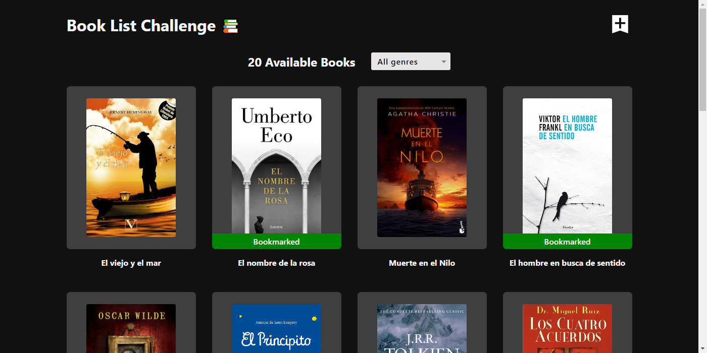
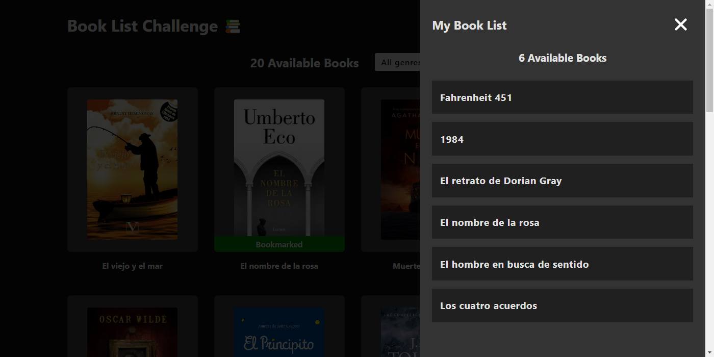

# 01 - Desarrollo de una Aplicación de Lista de Libros

El objetivo de esta prueba es diseñar e implementar una pequeña aplicación web de lista de libros utilizando las herramientas de tu elección.

- [¿Cómo puedo participar?](https://github.com/midudev/pruebas-tecnicas#c%C3%B3mo-participar)
- **La prueba está abierta a revisión hasta el 27 de julio de 2023**
- Prueba basada en [esta prueba real para Juniors](https://discord.com/channels/741237973663612969/848944161448132628/1127729621744500806).
 
Este proyecto busca probar tus habilidades en el manejo de interacciones con el usuario, gestión del estado, filtrado de datos y la estructuración del código.


## Contexto

Somos un sello editorial de libros multinacional. Queremos ofrecer a nuestro público una forma de ver nuestro catálogo y poder guardar los libros que les interesan en una lista de lectura.

Para ello, queremos desarrollar una aplicación web que permita a los usuarios ver los libros disponibles y crear una lista de lectura. Ten en cuenta que:

- No sabemos si el framework que utilicemos ahora será el definitivo, pero querremos reutilizar el máximo de código posible.
- La aplicación debe ser fácil de usar y agradable a la vista.
- Tenemos un 80% de usuarios que vienen de navegadores de escritorio.

Usa el archivo `books.json` para obtener los datos de los libros. Puedes añadir más libros si lo deseas, siempre y cuando siga la misma estructura.

## Requisitos

### Funcionalidad

1. **Visualización de Libros Disponibles**: La aplicación debe mostrar una lista de libros disponibles que el usuario pueda revisar.

2. **Creación de Lista de Lectura**: El usuario debe ser capaz de crear una lista de lectura a partir de los libros disponibles. En la UI debe quedar claro qué libros están en la lista de lectura y cuáles no. También debe ser posible mover un libro de la lista de lectura a la lista de disponibles.

3. **Filtrado de Libros por Género**: Los usuarios deben poder filtrar la lista de libros disponibles por género, y se mostrará un contador con el número de libros disponibles, el número de libros en la lista de lectura y el número de libros disponibles en el género seleccionado.

4. **Sincronización de Estado**: Debe haber una sincronización del estado global que refleje el número de libros en la lista de lectura y el número de libros todavía disponibles. Si un libro se mueve de la lista de disponibles a la lista de lectura, el recuento de ambos debe actualizarse en consecuencia.

5. **Persistencia de Datos**: La aplicación debe persistir los datos de la lista de lectura en el almacenamiento local del navegador. Al recargar la página, la lista de lectura debe mantenerse.

6. **Sincronización entre pestañas**: Si el usuario abre la aplicación en dos pestañas diferentes, los cambios realizados en una pestaña deben reflejarse en la otra. Sin necesidad de usar Backend.

7. **Despliegue**: La aplicación debe estar desplegada en algún servicio de hosting gratuito (Netlify, Vercel, Firebase, etc) y debe ser accesible a través de una URL pública. Indica la URL en el README.

8. **Test**: La aplicación debe tener AL MENOS un test. Haz el test que consideres más importante para tu aplicación.

## Consejos sobre el código

1. **Estructura del código**: El código debe estar bien organizado y fácil de leer.

2. **Semántica HTML**: El HTML debe ser semántico y accesible.

3. **Pensando en equipo**: Prepara tu proyecto pensando que cualquier persona de tu equipo puede tener que trabajar en él en el futuro. (scripts en el package.json, mínima documentación en el README, comentarios en el código si es necesario, etc)

4. **Formatea tu código**: Asegúrate de que tu código está formateado de forma consistente. Puedes usar Prettier o cualquier otra herramienta que te guste.

5. **Preparado para producción**: Asegúrate de que tu aplicación está lista para producción. Minimiza el código, optimiza las imágenes, etc.

## Desafíos adicionales

**¿Quieres ir más allá?** Estos son algunos desafíos adicionales que puedes intentar:

- Implementar una funcionalidad de búsqueda en la lista de libros disponibles.
- Añade un nuevo filtro para filtrar los libros por número de páginas.
- Permitir la reorganización de los libros en la lista de lectura por prioridad.
- Haz que tu diseño sea responsive.

## Entrevista

Si pasas a la siguiente fase, te pediremos que hagas una entrevista con nosotros. Durante la entrevista, te pediremos que expliques tu código y que hagas algunos cambios en el mismo.

- Nos tendrás que explicar el código que has escrito y las decisiones que has tomado.
- Haremos cambios en el JSON y tendrás que adaptar el código en vivo.
- Añadiremos un nuevo filtro a la aplicación y tendrás que implementarlo.

Buena suerte y ¡diviértete programando!

## Referencias

- Diseño de Josh W. Comeau para una aplicación de libros pendientes de leer: https://twitter.com/JoshWComeau/status/1678893330480898049

- Dribbble con rediseño de Goodreads: https://dribbble.com/shots/2523654-Books-listing-page-goodreads

- Concepto de uso de arrastrar libros: https://dribbble.com/shots/19351938-Mybooks-Page-Board

- Concepto de landing para una aplicación de libros: https://dribbble.com/shots/16279204-Book-Web-Store-Concept

# Solution





### Link

- [Live site](https://book-list-challenge.vercel.app/)

### Built with

<p>
 <a href="https://www.typescriptlang.org/">
  
 </a>
  <a href="https://sass-lang.com/">
  
 </a>
  <a href="https://react.dev/blog/2023/03/16/introducing-react-dev">
  
 </a>
  <a href="https://vitejs.dev/">
  
 </a>
</p>

## Run the project locally

1. Clone this repository

2. Install dependencies

  ```sh
   npm install
   ```

3. Start the local server

  ```sh
   npm run dev
   ```

4. Open http://localhost:5173/ in your browser